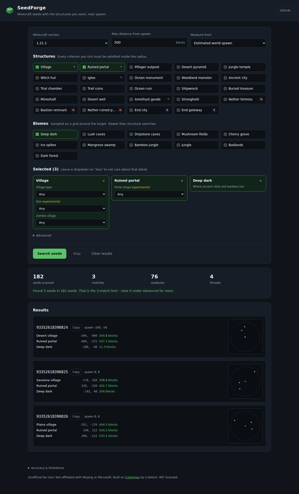

# SeedForge

**Find Minecraft seeds with the structures and biomes you want, near spawn. Java and Bedrock.**

[](LICENSE)
[](https://fwsoapy.github.io/seedforge/)
[](https://github.com/Cubitect/cubiomes)

SeedForge searches for Minecraft seeds where everything you ask for generates
within a distance you choose of world spawn. Tick village, ruined portal and
deep dark, set the radius to 500 blocks, hit search, and it hands you seeds that
satisfy all three at once.

It runs entirely in your browser. There is no seed database, no backend, no
account and nothing leaves your machine.

**Live demo:** https://fwsoapy.github.io/seedforge/



## Features

- **Multi-criteria search.** Pick as many structures as you like. A seed only
  counts when *every* one of them has at least one instance inside its radius.
- **A distance per criterion.** Each pick carries its own limit, so "village
  within 100 blocks, ruined portal within 500" is one search, not a compromise.
- **Proximity rules.** Require two picks to generate near each other -
  "ruined portal within 100 blocks of the village" - on top of their own
  distances from spawn. These work across the Overworld and the Nether too:
  "bastion within 300 blocks of the ruined portal" divides the portal's
  coordinates by 8 to find where it drops you, and measures from there.
- **Biome criteria too.** Split into Popular (plains, forest, birch forest,
  dark forest, taiga, desert, savanna, jungle, swamp, ocean, beach and friends)
  and Exotic (deep dark, sulfur caves, lush caves, mushroom fields, cherry
  grove, ice spikes, pale garden, badlands), searchable alongside structures.
- **Variant filters.** Village biome type (plains, desert, savanna, taiga,
  snowy) and zombie villages are exact. Ruined portals split into three
  independent selectors - type, placement and template. Bastion remnants filter
  by all four in-game types, and strongholds by ring. Village size, igloo
  basements and cracked geodes are clearly labelled best-effort filters.
- **Measure from where it matters.** World origin (fastest), estimated world
  spawn, or the exact world spawn (slowest but accurate).
- **All three dimensions.** Nether fortresses, bastions and End cities are
  searchable alongside overworld structures.
- **Java and Bedrock.** Bedrock places structures with a 32-bit Mersenne
  Twister instead of Java's LCG; both generators are implemented, and the
  structure list narrows to what Bedrock actually places.
- **Version aware.** Pick anything from 1.7 to 26.2; the structure and biome
  lists change to match what actually exists in that version.
- **Multi-threaded.** One Web Worker per logical CPU by default, each scanning
  its own stripe of the seed space. Set the thread count yourself under
  Advanced, or leave it on 0 for automatic.
- **Streaming results, closest first.** Matches appear as they are found and
  the list re-sorts so the tightest seed is always on top, ranked by the
  furthest structure in each. Live counters, and a stop button that works.
- **Preview map.** Every result gets a map with compass directions and hover
  details. It scales to the structures rather than the search radius, so a
  find inside 300 blocks is drawn at 300 blocks even if you searched 1000.
  Enlarge it for a full-size view with scroll to zoom and drag to pan.
- **Private by design.** 100% client-side. No API keys, no analytics, no data
  collection.

## How it works

Minecraft's world generation is deterministic: given a seed, the position of
every structure is fixed and computable without generating a single chunk.

Structure placement uses a region grid. The world is divided into regions of
*N* chunks on a side, and within each region one generation attempt position is
derived from the region coordinates, the world seed, and a salt constant unique
to that structure type. That gives a candidate position with nothing but a few
RNG steps. Whether a structure actually generates there is then decided by a
biome check (and, for a handful of 1.18+ structures, a surface-height check).

SeedForge does this in two stages, which is where the speed comes from:

1. **Cheap stage.** For each candidate seed, compute the generation attempt
   positions for every selected structure and throw the seed away immediately
   unless all of them have a hit inside the radius. This is pure integer math.
2. **Expensive stage.** Only for the survivors, build the biome generator for
   that seed and confirm each position with a real biome check, plus any
   variant constraints you asked for.

On Java, only the low 48 bits of a world seed affect structure placement; the
upper 16 bits only change biome generation. The search therefore walks the
48-bit space, which is why returned Java seeds are positive numbers below 2^48.
A Bedrock world seed is 32 bits, so those come back as 32-bit values. Either
way they are ordinary seeds: paste them straight into the world creation
screen.

The Java math comes from [Cubiomes](https://github.com/Cubitect/cubiomes), a C
reimplementation of Minecraft Java Edition's biome and structure generation,
compiled to WebAssembly, plus a small patch for the versions upstream has not
caught up with yet. Bedrock structure placement is implemented here directly,
because Cubiomes does not cover it. Biomes need no second implementation: the
two editions were unified onto the same generator in 1.18. Nothing is looked up
in a database of precomputed seeds.

## Supported Minecraft versions

Anything from 1.7 up to **26.2**, the current release, for Java. Bedrock
searching covers 1.18 and later - that is when the two editions were unified
onto the same world generator, and before it the biome checks would not mean
anything. See [`vendor/patches/`](vendor/patches/README.md) for how Bedrock
placement works and what it cannot do. Minecraft moved to
year-based version numbers in 2026: 26.1 was the first game drop of that year,
26.2 "Chaos Cubed" the second.

Upstream Cubiomes stopped at the 1.21 Winter Drop in November 2024, so the
versions past it are built from a patch kept in
[`vendor/patches/`](vendor/patches/README.md) and applied at build time. The
pinned submodule is never modified. What the patch covers:

| Version | World generation |
| --- | --- |
| 1.21.4 (Garden Awakens) | Pale garden. This is what Cubiomes called `MC_1_21_WD`. |
| 1.21.5 (Spring to Life) | Pale garden expansion, mansions in pale gardens. Uses its own biome tree. |
| 1.21.6 - 1.21.11 | No world generation changes. |
| 26.1 (Tiny Takeover) | No world generation changes. |
| 26.2 (Chaos Cubed) | Added sulfur caves, which are searchable. |

| Version | Notable structures added |
| --- | --- |
| 1.7 - 1.12 | Villages, temples, witch huts, igloos (1.9+), monuments (1.8+), mansions (1.11+) |
| 1.13 | Ocean ruins, shipwrecks, buried treasure |
| 1.14 | Village overhaul (biome types), pillager outposts |
| 1.15 | - |
| 1.16 | Ruined portals, bastion remnants, nether fortress relocation |
| 1.17 | Amethyst geodes |
| 1.18 | World generation overhaul (noise-based biomes) |
| 1.19 | Ancient cities, trail ruins (1.19.4+) |
| 1.20 | - |
| 1.21 | Trial chambers |
| 26.2 | Sulfur caves |

Which structures and biomes appear is decided by the generator itself rather
than a hardcoded table, so the lists are always consistent with the code that
actually runs.

## Tech stack

| Layer | Choice |
| --- | --- |
| Java generation | [Cubiomes](https://github.com/Cubitect/cubiomes) (C, MIT), as a git submodule, plus `vendor/patches/` for newer versions |
| Bedrock placement | Implemented in `wasm/bindings.c` (MT19937 and the region grid) |
| Bindings | `wasm/bindings.c` - a thin C layer exposing a chunked search |
| Compilation | Emscripten to WebAssembly |
| Frontend | TypeScript, no framework |
| Bundler | Vite |
| Concurrency | Web Workers, one per logical CPU |
| Tests | Vitest, running against the real WASM build |
| Hosting | GitHub Pages via GitHub Actions |

## Local development

You need Node 20+, a C toolchain and the
[Emscripten SDK](https://emscripten.org/docs/getting_started/downloads.html).

```bash
# 1. clone with the Cubiomes submodule
git clone https://github.com/fwsoapy/seedforge.git
cd seedforge
git submodule update --init --recursive

# 2. install the Emscripten SDK (once)
git clone https://github.com/emscripten-core/emsdk.git ~/emsdk
~/emsdk/emsdk install latest
~/emsdk/emsdk activate latest
source ~/emsdk/emsdk_env.sh

# 3. build the WebAssembly core
npm install
npm run build:wasm        # -> src/wasm/seedforge.{js,wasm}

# 4. run it
npm run dev               # http://localhost:5173/seedforge/
```

Other scripts:

```bash
npm run typecheck   # tsc --noEmit
npm test            # vitest, needs build:wasm first
npm run build       # typecheck + production bundle into dist/
npm run preview     # serve dist/
```

`src/wasm/` is generated output and is not checked into git - run
`npm run build:wasm` after a fresh clone, and again whenever you change
`wasm/bindings.c` or update the submodule.

## Usage

1. Pick your edition and Minecraft version.
2. Tick what you want. Each pick gets its own distance box, so a village can be
   held to 100 blocks while a ruined portal is allowed 500.
3. Choose what you are measuring from. This is the single biggest lever on
   search speed: working out each seed's spawn point costs around 4ms, which is
   most of the time a search spends. Measuring from **world origin (0, 0)** is
   roughly **50x faster** (about 12,000 seeds/sec per thread versus 250), and
   for "near spawn" searches the two rarely disagree by much. Use
   "exact world spawn" only when you need it to match the game precisely.
4. Leave a variant dropdown on **Any** when you do not care. The structure
   still has to exist inside the radius, just without a type constraint.
5. Add a proximity rule if you want two picks near each other.
6. Hit **Search seeds**. Results stream in closest-first as they are found;
   **Stop** halts the search at any time.
7. Copy a seed and paste it into the Minecraft world creation screen.

If a search runs for a long time with no hits, the filter combination is
probably very rare. Widen the radius, drop a structure, or relax a variant
filter. Woodland mansions, ancient cities and End cities are the usual
suspects.

### Under Advanced

- **Start seed** - where the scan begins. Blank means a random start (48-bit on
  Java, 32-bit on Bedrock), so two people running the same query get different
  seeds.
- **Stop after N matches** - the search halts once it has that many.
- **Worker threads** - 0 means automatic, one per logical CPU.

## Known limitations

- In 1.18 and later, desert pyramids, jungle temples and woodland mansions also
  depend on surface height at their bounding-box corners. Cubiomes approximates
  that check from noise parameters, so rare false positives are possible.
- "Estimated world spawn" can differ from the real in-game spawn by a few dozen
  blocks, because the game's final spawn search depends on block-level terrain.
- Nether structure distances are measured in Nether coordinates, from the
  Nether-side equivalent of the target point (x/8, z/8).
- Village size is **experimental**. Cubiomes exposes the village's starting
  meeting-point piece, and its footprint is what the size filter buckets on.
  The jigsaw expansion that decides the real final size is not modelled, so
  treat it as a hint rather than a guarantee. It is labelled as such in the UI.
  Village biome type and zombie villages, by contrast, are exact.
- Strongholds never generate closer than about 1280 blocks, and End cities never
  within 1008 blocks of the End origin. Asking for either at a small radius will
  never match.
- Stronghold **portal room orientation and library presence are not
  filterable**. Those depend on the stronghold's internal piece layout, which
  Cubiomes does not generate, so there is no honest way to offer them.
- Proximity rules work within a dimension, and between the Overworld and the
  Nether - the Overworld side is divided by 8 and the rule is measured in
  Nether blocks. Rules reaching into the **End** are rejected, because End
  coordinates have no correspondence to the other dimensions.
- **Ravines and individual caves are not searchable.** They are carvers, cut
  into terrain per chunk during world generation, not region-grid structures,
  and Cubiomes does not model them. The closest available thing is the **lush
  caves** and **dripstone caves** biome criteria, which do find large cave
  systems.
- Biome criteria are **sampled on a grid** - 1:16 for normal radii, coarser for
  very large ones. A biome patch smaller than the sample spacing can be stepped
  over, so a biome search can miss a small patch. It never invents one. Biome
  searches are also noticeably slower than structure searches.
- Biomes are three-dimensional from 1.18 on, so each one is sampled at a height
  it actually occupies: caves underground, peaks high up, everything else near
  the surface. Every biome in the list has been checked to confirm it really
  turns up rather than silently matching nothing.
- Ore placement is not searchable at all.

Always verify a seed in-game before committing a world to it.

## Roadmap

- [x] Biome criteria alongside structures
- [x] Per-criterion distances and proximity rules between structures
- [x] Minecraft 26.x support, sulfur caves included
- [x] Bedrock Edition support (1.18+)
- [ ] Ruined portal chest loot filtering (blocked: needs exact structure
      altitude to derive the chest's loot seed - see
      [`vendor/patches/README.md`](vendor/patches/README.md))
- [ ] Cluster/quad searches (e.g. four witch huts in one perimeter)
- [ ] Shareable search URLs
- [ ] Export results as JSON/CSV
- [ ] An inline map preview of the surrounding biomes for a chosen seed

## FAQ

**Is this an official Minecraft tool?**
No. It is an unofficial fan tool, not affiliated with Mojang or Microsoft.

**Does it work for Bedrock Edition?**
Yes, for 1.18 and later. Bedrock places structures with a different generator
to Java, and that generator is implemented here. Pick Bedrock from the edition
dropdown and the structure list narrows to what Bedrock actually places.

**How do I find a seed with a village near spawn?**
Tick Village, set its distance to whatever you can walk, and search. Add a
second structure if you want both near spawn; a seed only counts when every
criterion is satisfied.

**Can I search for two structures near each other rather than near spawn?**
Yes, that is what proximity rules are for. "Ruined portal within 100 blocks of
the village" is a condition in its own right, on top of each structure's own
distance from spawn. Overworld to Nether works too, measured in Nether blocks.

**Can I find a seed with an ancient city or a deep dark near spawn?**
Yes. Ancient city is a structure and deep dark is a biome, so you can ask for
either or both.

**Why is my search slow?**
Working out each seed's world spawn costs a few milliseconds and is most of
the cost. Switching "Measure from" to world origin is roughly 50x faster, and
for near-spawn searches the two rarely disagree by much.

**Does it upload my seed anywhere?**
No. There is no backend and no analytics. Everything is computed in your
browser, and closing the tab is the end of it.

**Which Minecraft versions are supported?**
Java 1.7 through 26.2, and Bedrock 1.18 and later. Minecraft moved to
year-based version numbers in 2026, so 26.2 is the current release.

**Can I search for ravines, caves or ore?**
No. Ravines and caves are carved into terrain per chunk rather than placed on
a region grid, so they cannot be computed the way structures can. The lush
caves and dripstone caves biome criteria are the closest thing available.

## Contributing

Bug reports and pull requests are welcome - see [CONTRIBUTING.md](CONTRIBUTING.md).

## License

MIT - see [LICENSE](LICENSE). Third-party licenses are listed in
[THIRD_PARTY_LICENSES.md](THIRD_PARTY_LICENSES.md).

## Credits

- **[Cubiomes](https://github.com/Cubitect/cubiomes) by
  [Cubitect](https://github.com/Cubitect)** - the entire generation engine
  behind this tool. SeedForge is a UI on top of Cubitect's work; if you find
  this useful, go star that repository.
- [Emscripten](https://emscripten.org/) for the C-to-WebAssembly toolchain.
- Mojang Studios, for a world generator that happens to be reproducible.

## Disclaimer

SeedForge is an unofficial fan-made tool. It is not affiliated with, endorsed
by, or associated with Mojang Studios or Microsoft. "Minecraft" is a trademark
of Mojang Synergies AB.

Results are computed estimates. They are derived from a reimplementation of
Minecraft's generation algorithms and have known edge-case limitations (see
above). Verify in-game before relying on a seed.
